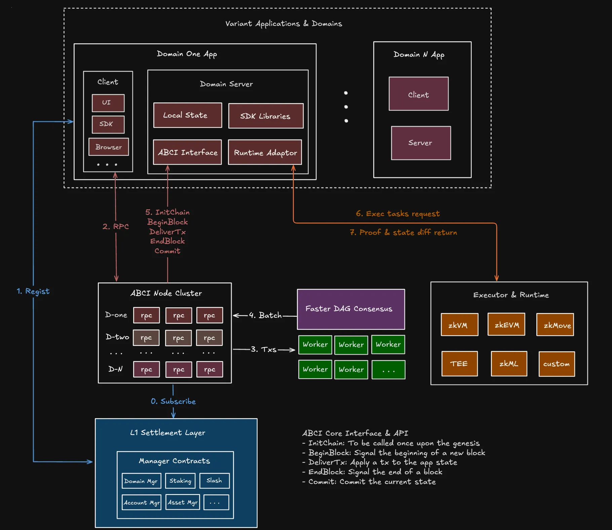

# Causality Ledger

## Components

* Reliable stream of hashes of batches of transactions from Bullshark and Narwhal
* Reconstruction of the ledger by querying Narwhal workers' stores for the confirmed batches of transactions
* Delivery of the reconstructed ledger over RPC to the application logic
* Implementation of a shared Rust domains app

## Architecture

## Run nodes

Setup/dependencies (from the main folder of the repository):
* [Rust](https://www.rust-lang.org/)
* [Python Poetry](https://python-poetry.org/)
* [tmux](https://github.com/tmux/tmux)
* `cd scripts && poetry install`

Run network (from the main folder of the repository):
1. 1st terminal: `cd scripts && cargo build && poetry run fab local`
2. 2nd terminal (after the testbed has started in 1st terminal): `cargo run --bin evm-client`

The second command will produce output like this:  

* The test environment consensus network is run by four nodes (each running on localhost), whose RPC endpoints are reachable on TCP ports 3002, 3009, 3016, and 3023, respectively. 
* There are three accounts, Alice (initially 1.5 ETH), Bob (initially 0 ETH), and Charlie (initially 0 ETH). Alice performs a `double spend`, sending 1 ETH each to Bob and Charlie in two different transactions that get input to the nodes at ports 3009 and 3016, respectively. Note that only one transaction can make it. 
* Eventually, nodes reach consensus on which transaction gets executed in Domain's executing Env, and the application state is updated in lockstep across all nodes. The update is reflected in subsequent balance queries.